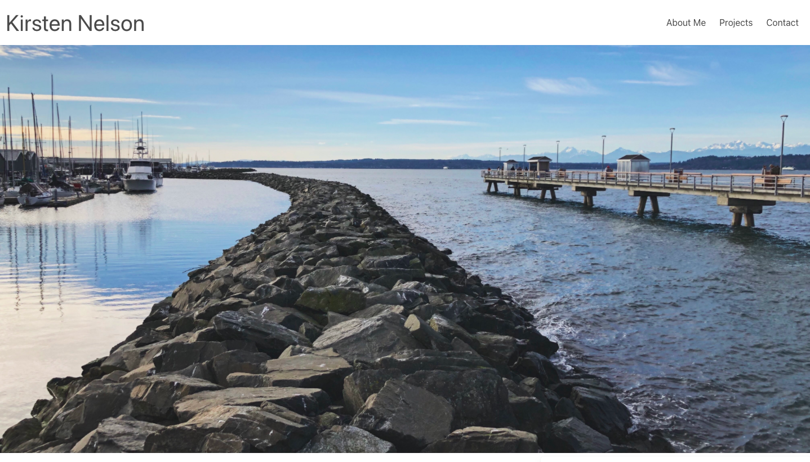
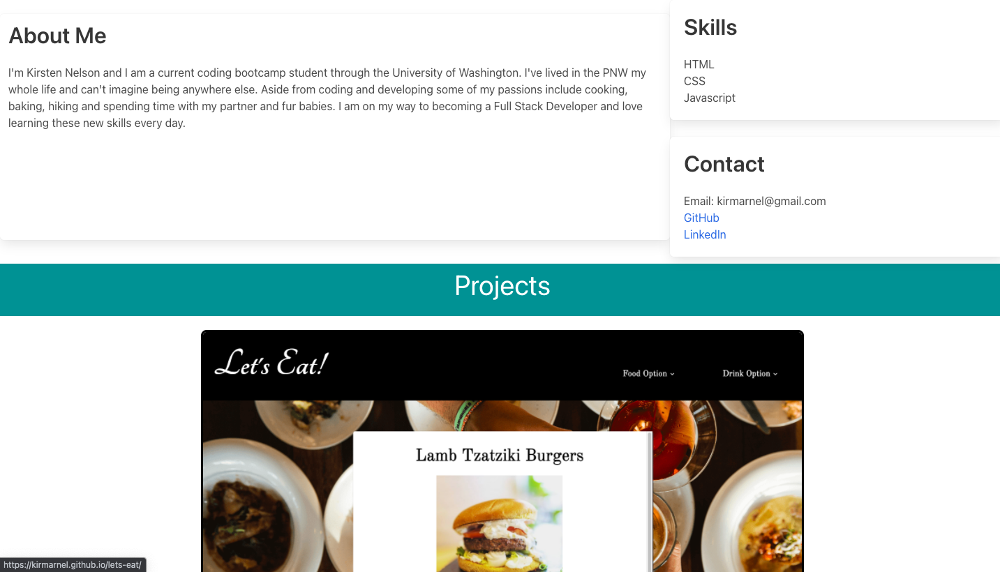

# Portfolio 2

## Description
This is the secound iteration of my personal portfolio. Instead of updated my last portfolio I decided to start from scratch and try something new. To do this I used Bulma and some of my own css styling. Overall I am very happy with how it turned out. 
--
## Technologies Used
* HTML
* CSS
* Bulma
* Javascript

## Demo
 

--
## Challenges 
I think the only challenge for me was learning how to use Bulma. This is my first time using it so I needed to really familiarize myself with the documentation. It also took me some time to figure out how to get the hamburger menu to be functional, as the javascript for this is not included in the documentation. 
--
## Deployment Link
https://kirmarnel.github.io/portfolio2/